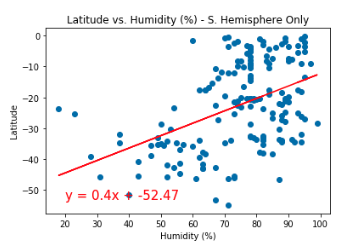

# Weather/Vacation-APIs-with-Python

### Summary | GRADE: A+ 

This project was used to practice API calls in Python, specifically OpenWeatherMap and Google Places. It was divided into two parts. The first was calls to OpenWeather Map to collect and analyze the data in the given cities. The second part was to use Gmaps to create a heatmap and Google Places to create tooltips on specific cities. 

### Project Writeup

#### WeatherPy

Starter code was given to generate a list of 1500 lat-long coordinates which then used the citipy module to match those coordinates to city names. My code begins with using an API request to openweathermap.org to determine several different weather statistics for each city, if they are available. As of the most recent pull, 2/1/2021 at about 12pm, weather data was collected for 620 cities around the world. 

After cleaning the data frame to drop null values, I created scatter plots for each variable (temperature, humidity, cloudiness, and wind speed) vs latitude. Analysis for each scatter plot is in markdown cells in the notebook below each plot. I then split original data frame between the northern and southern hemispheres and generated the same plots again, which also included regression lines. Analysis for each set of scatter plots is in markdown cells in the notebook below each pair.

##### Scatter Plots

  
  
  
  

#### VacationPy

After collecting and exporting the weather information in the above activity, I used that data with the gmaps module to generate a heat map of humidity across the globe. 

I then decided which weather condicions would suit my ideal vation spot. I chose a combination of comfortable temperatures (between 60 and 80 degrees) low to mid-humidity levels, low cloud cover, and low wind speeds (see code for exact numerical bounds). After filtering this data down to those conditions, I limited the results to 5 cities.

With those five cities, I used their lat-long corrdinates to make requests to the Google Places API, which returned the closest lodging within 5000 meters of the city coordinates. I used the lodging information to place pins at each city along with the hotel retrieved. As of the latest run of the code, my ideal vacation spots are in Eastern Mexico, North and Southern Chile, Western Argentina and SouthEastern Australia. 

